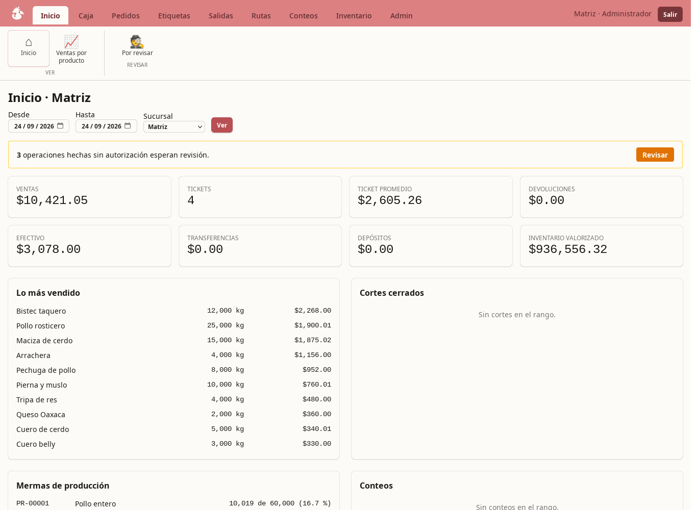
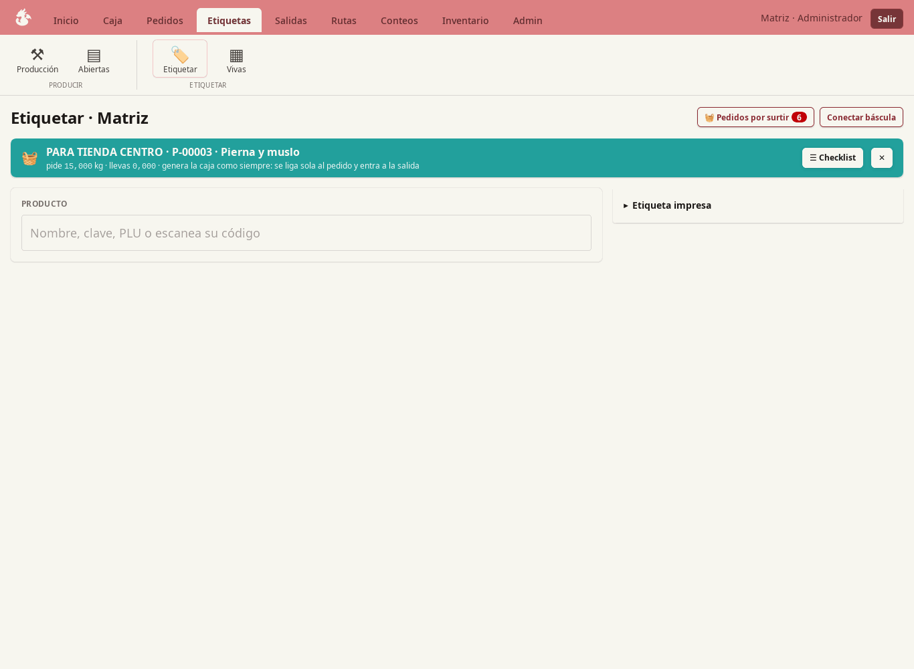
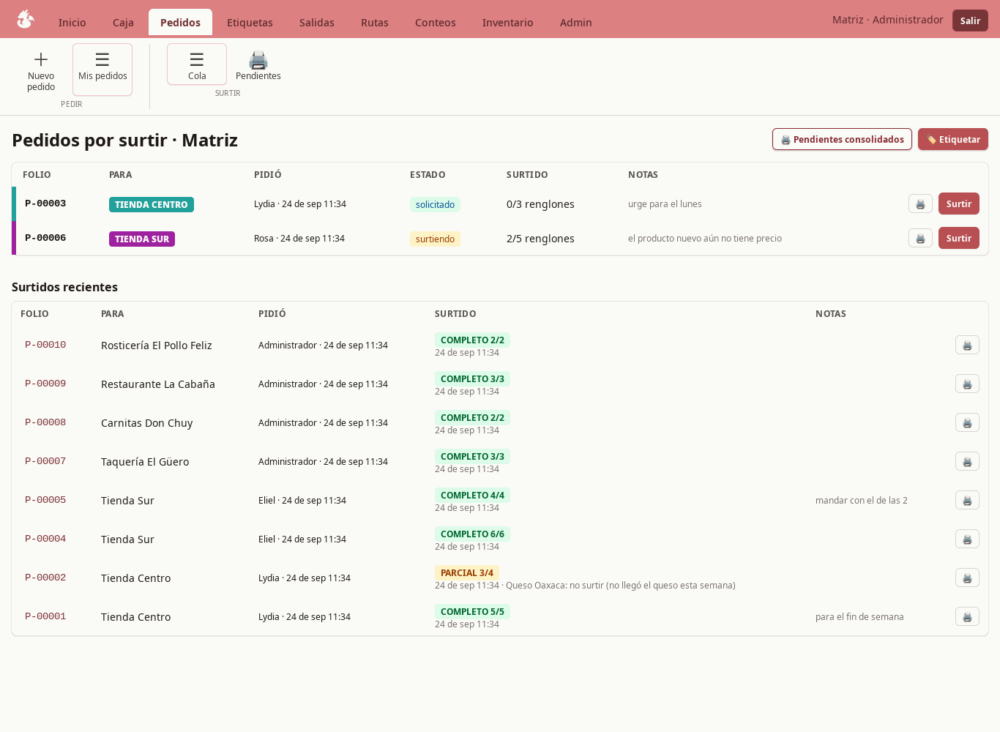
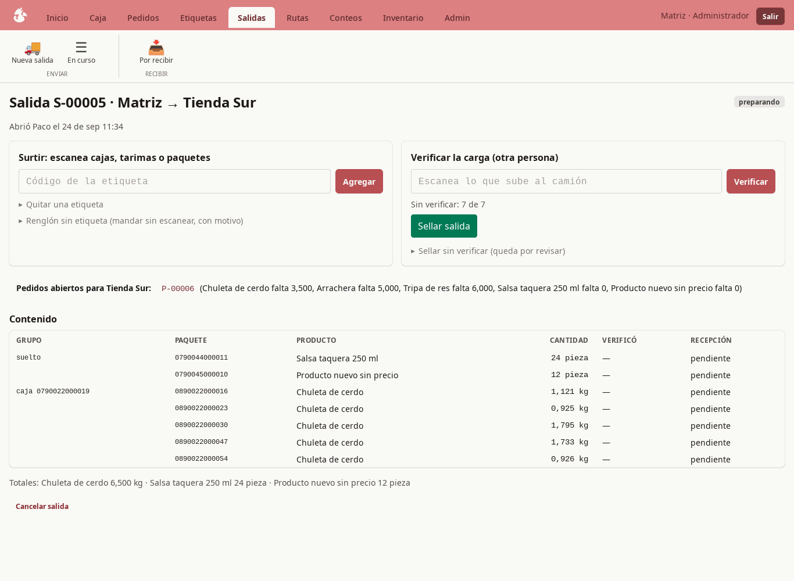
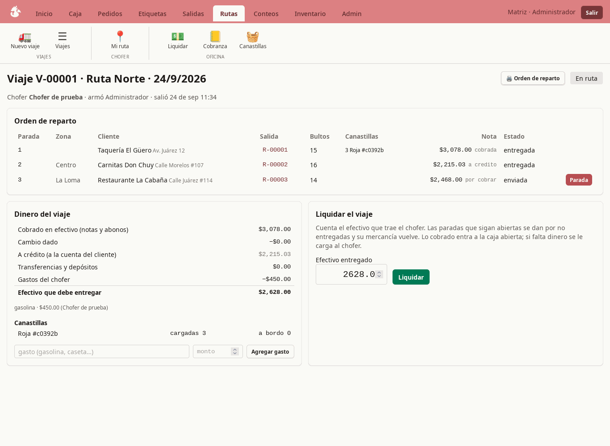
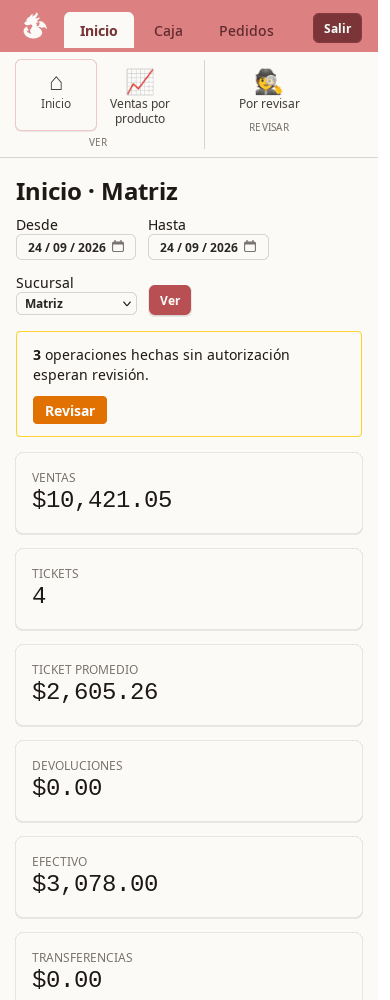

[🇪🇸 Español](README.es.md)

<div align="center">
  <br/>

<picture>
  <source media="(prefers-color-scheme: dark)" srcset="docs/logo/kobayashi-logo-w.png">
  
</picture>

# Kobayashi

**帳 · Point of sale, labeler and back office for small businesses, by modules: a grocery store, a greengrocer that weighs and labels, a distributor with delivery routes, or a plant that supplies its own shops. Ruby on Rails.**

<br/>


<br/>

*Identity barcodes · append-only stock ledger · money in integer cents · one transaction per operation · nothing leaves without a scan*

</div>

---

> [!NOTE]
> Kobayashi was born for a meat plant, built **register first** instead of domain first, and is now generalised by modules. It runs on one server for the head office and its branches. It is in active development and has not yet run a real day of sales.

<br/>

## 🏪 What it is

One system, one database, and **modules that turn on or off per business**. Register, inventory, settings and administration are always there; the rest depends on what the business does and can be changed any time in Settings. On the first run, with an empty database, it asks for the business name, its type and the first administrator, and that is it.

| Type of business | Modules that start on |
|---|---|
| **Grocery / retail store** | register, inventory, administration and **purchasing**. Products by piece with the supplier's barcode. |
| **Greengrocer / produce** | the above plus **labels and production**: weigh on the scale, print identity labels, production runs with shrinkage. |
| **Distributor** | purchasing, orders, transfers between branches, **delivery routes** (driver, collections, credit, crates, agreements) and counts, without the labeler. |
| **Plant with stores and delivery** | everything. |

Where labels are on, every package, box and pallet carries an **EAN-13 identity barcode**: the code names the row in the database, the weight lives in the database, never inside the code. A module that is off disappears from the ribbon, from the roles and from its screens; its data stays, and it cannot be turned off while it has open work.

| Module | What it does | Rule it enforces |
|---|---|---|
| **Purchasing** | Suppliers, goods receipt by scanning the supplier's barcode (stock goes in, crates/pallets/totes are noted), the supplier's invoice entered afterwards with its lines, accounts payable with due dates, and payments that leave the open drawer as a withdrawal. Invoiced vs received, per product, side by side. | The invoice is the only thing that creates debt and the only place a purchase price lives; stock never carries cost. One payment path: cash comes out of the drawer, the ledger is append-only, voiding compensates. No purchase orders. |
| **Orders** | A shop or a route customer asks for goods; the headquarters fulfils line by line. | Fulfilled quantity is always the sum of the labels linked to the line, never a stored counter. |
| **Production** | Raw product goes in, labelled cuts come out, the difference is waste. | Nothing comes out that did not go in. Production has nothing to do with orders: it is an input and its outputs. |
| **Labels** | Package, box and pallet with identity barcodes, printed at 55×45 mm. | No free labelling: every label comes from an order line, a production run, or a recorded authorisation. |
| **Dispatch** | Scan to pick, a second person scans to verify the load, seal, send. | The picker cannot verify their own load. A label can be in only one active dispatch. |
| **Receiving** | The shop scans package by package (or a whole pallet); missing or broken packages are reported by barcode. | What is not scanned does not enter stock. Boxes are not accepted whole. |
| **Register** | Scan or type, scale for loose kilos, mixed payments, 80 mm ticket with its own barcode, cash drawer with float, withdrawals and close. | No sale without stock, without an open drawer, or above the cash limit. A product with no price at that branch cannot be sold. Price cuts go to the review tray and never go under the floor (50 % of list by default). |
| **Routes** | A trip per route and day: sealed deliveries board in stop order, the truck leaves, and the driver works from the phone: scan what gets off, reject what the customer refused, collect cash, take the order for the next visit. Back at the office the trip is settled: cash collected minus expenses is what the driver hands in; any shortfall is charged to the driver. | Money collected on the road is not in the drawer until settlement. Rejected goods return to stock the moment they are refused. Delivering without scanning is allowed but goes to the review tray. |
| **Zones and delivery order** | A route has zones in order; each customer sits in a zone with a number. When a trip is built the stop order is generated from that (zone, then number), the office can move stops by hand before leaving, and the printed delivery order goes with the driver. | The order lives on the trip, not in someone's head. |
| **Crates** | Crates are a loaned asset, by type (brand/colour). They load at departure, get handed over at the stop, come back when the customer returns them (at the stop or at the warehouse) and unload at settlement. Balances per customer and per driver, with adjustments. | Every movement carries its reason and its user. |
| **Price agreements** | A customer can have a fixed price per kilo on given product lines up to a weekly cap in crates, accumulated across all their notes of the week; the excess goes at list price. | Applied when the note is closed at departure; rejected notes give the cap back. |
| **Route credit** | Each customer has a credit type as the business runs it: cash only, note by note, limit, weekly (pays at the cut-off), cash-while-paying-down (7 days), special (own cut-off day). At the stop the driver can leave the note on account if the rule allows; the customer can also pay down old debt. Collections screen with balances, ageing, statements, office payments and a manual block that overrides the rule. | Blocking is computed live from the account: when the customer pays, it opens by itself. The point of sale stays cash only. |
| **Shipping without scanning** | A line without a label can go in any dispatch with a reason, and a dispatch can be sealed without the second scan with a reason. | Both land in the review tray in the name of whoever did it. The double scan (pick, verify) is the norm, not a wall. |
| **Route sales** | Dispatch to a customer closes a note payable on delivery; the driver comes back and the delivery is charged into the open drawer. | Rejected goods come back as a return against the ticket. Cash only. |
| **Counts** | The supervisor scans everything; the count wins. | Stock is adjusted, unseen labels die, and the shortage is charged to the cashier. |
| **Prices** | List price, per-shop overrides, promotions (special price, percentage, volume). | The register applies the cheapest valid rule by itself; a promotion never raises a price. |
| **Deferred authorization** | Anything that would need a supervisor (free labelling, a line without a label, a stock adjustment, a cash withdrawal, a price cut) goes through with a reason when nobody is around, and lands in a review tray. | The flow never stops; the supervisor approves or flags each one at the end of the day, and a flagged one can be charged to whoever did it. Whoever has the permission does it in their own name and skips the tray. There are no PINs. |
| **Dashboard & admin** | Sales, tickets, payment mix, closes, waste, counts, valued stock, CSV by product; products, users, roles, shops, customers, routes. | Permissions by key, ribbon tabs appear only for what the user may do. |

<br/>

## 📸 Screenshots



*Home: the day's board for the branch (sales, cash, top sellers, what awaits review).*



*Labeling against an order: the banner carries the destination colour; every box goes straight into the outbound note.*



*Orders queue: what is pending, what shipped complete or partial.*



*An outbound note: pick by scanning, a second person verifies, seal, ship.*



*A delivery trip: stops in order, what was collected, what the driver owes.*



*It also fits a phone.*

## 🧭 Design

- **The ledger is the truth.** `Movimiento` is insert-only; `Existencia` is a projection updated in the same transaction, with `CHECK (cantidad >= 0)` in the database.
- **Spanish models and tables**, because the business already speaks that language: pesada, caja, traspaso, corte, folio.
- **One transaction per operation**, one code path per operation. No fallbacks.
- **Kilos, litres and metres to three decimals, pieces whole, money in integer cents**, one clock (Mexico City), business date separate from capture time.
- **Scale in the browser** through Web Serial with [Kana](https://github.com/Chidaruma696/Kana) (Chrome or Edge only).
- **Office-style ribbon**: tabs per module, big buttons per action, filtered by permission.
- **Three languages**: English by default, Spanish and German; each user picks theirs in Settings, along with theme, density and font size.

<br/>

## 🚀 Run it

```
bin/setup        # bundle, database, seeds
bin/dev          # http://localhost:3000
```

On the first visit, with an empty database, the app asks for the business name, the head office and the first administrator (name, user, password, language) and signs you in; from there you add products, branches and users in Administration. Seeds only create the base roles. Tests: `bin/rails test`.

<br/>

## 📚 Credits and names

Kobayashi, Kana and Tohru take their names from *Miss Kobayashi's Dragon Maid* by Coolkyousinnjya; nothing here is affiliated with the author or the publishers. Scale protocol via [Kana](https://github.com/Chidaruma696/Kana) (MIT). Built with Rails, Hotwire and Tailwind.

## 📄 License

Apache 2.0. See [LICENSE](LICENSE) and [NOTICE](NOTICE).

Use it, change it, sell it; the only thing I ask is that you keep the notice and give visible credit: *based on Kobayashi, by Chidaruma696*.
